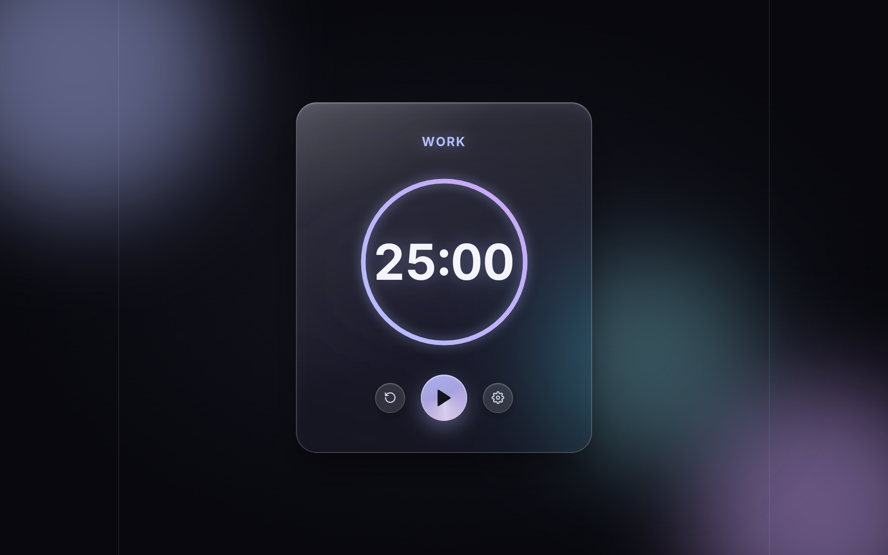

# Pomodoro - Liquid Glass

A clean, "liquid glass" styled Pomodoro timer built with Vue 3. A translucent, blurred glass card, soft floating color blobs in the background, and a gently rotating sheen on the main button create the visual identity, while the functionality stays a classic 25/5-minute work-break cycle.



## Features

- **Work / break cycle** – defaults to 25 minutes of work and 5 minutes of break, fully customizable
- **Visual countdown ring** – a gradient, glowing ring shows the time remaining, with a different color gradient for work and break mode
- **Browser notifications** – if permission is granted, the page sends a native notification when the timer runs out (`Notification` API)
- **Settings** – work and break duration can be adjusted in minutes inside a translucent "glass" modal
- **Liquid glass design** – `backdrop-filter` blur + saturate, layered shadows, a subtle specular highlight, and a slow rotating sheen on the play/pause button
- **Responsive and accessible** – scales down to mobile, has visible focus states, and respects `prefers-reduced-motion`

## Tech stack

- [Vue 3](https://vuejs.org/) – Composition API with `<script setup>`
- Plain CSS (scoped styles), no framework
- Native browser `Notification` API

## Getting started

Clone the git repo from github:

```bash
git clone https://github.com/zeti1223/pomodoro-vue.git
cd pomodoro-vue
npm install
```

```bash
npm run dev
```

By default the app runs at `http://localhost:5173`.

### Build for production

```bash
npm run build
```

The whole app lives in a single component — a deliberately simple setup for a small, standalone tool, with no router or state management library.

## Customization

| Want to change...? | Look here |
|---|---|
| Default work/break duration | `DEFAULT_WORK_TIME` and `DEFAULT_BREAK_TIME` at the top of `<script setup>` |
| Color palette (based on Catppuccin Mocha) | the hex values used throughout `<style scoped>` (`#b4befe`, `#a6e3a1`, `#cba6f7`, `#89dceb`) |
| Background blob size/movement | `.orb-a`, `.orb-b`, `.orb-c` and their `@keyframes float-*` |
| Ring size | the SVG `width`/`height`, the `circle` elements' `r`/`cx`/`cy`, and the `stroke-dasharray` / `strokeDashoffset` formula (recalculate as 2 × π × radius) |
| Glass intensity of the card | `.pomodoro-card`'s `backdrop-filter: blur(...) saturate(...)` and its background gradient |

> If you change the ring's radius, always update `stroke-dasharray` to match (circumference = 2 × π × radius), otherwise the progress indicator will render incorrectly.

## Accessibility & performance

- Every interactive element has a visible `focus-visible` outline
- Background animations and the button's sheen are disabled when `prefers-reduced-motion: reduce` is set
- The notification permission prompt only runs if the browser supports the `Notification` API
